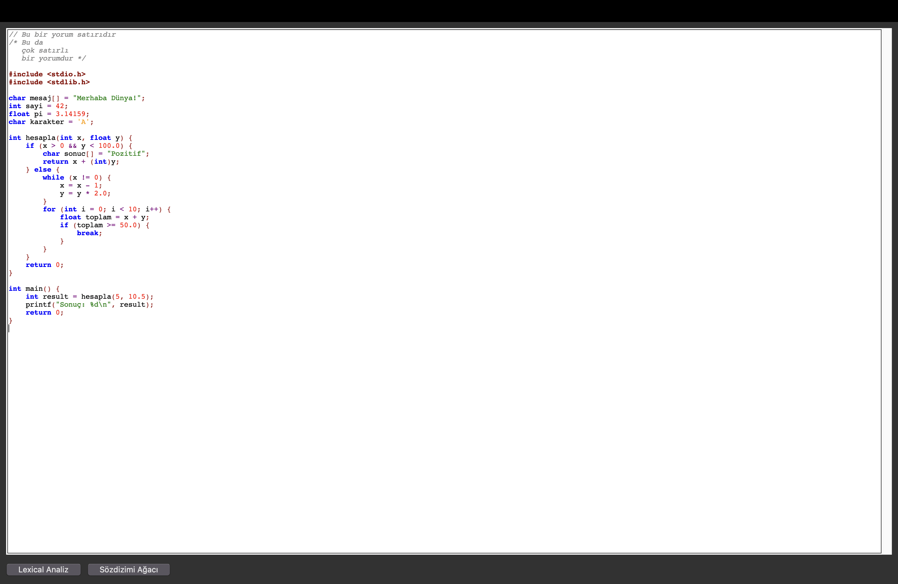
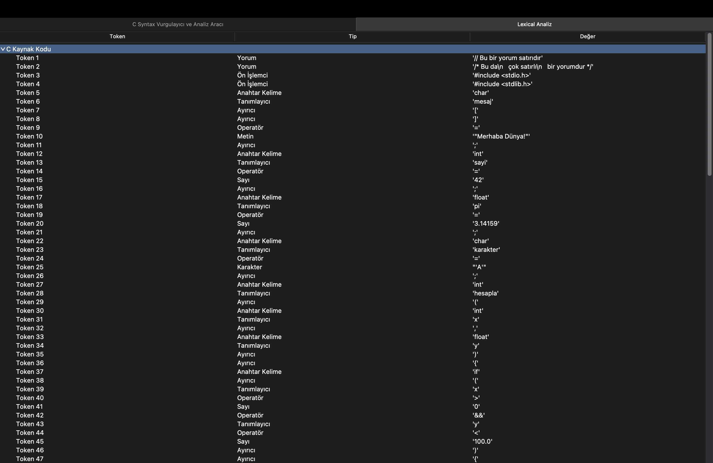
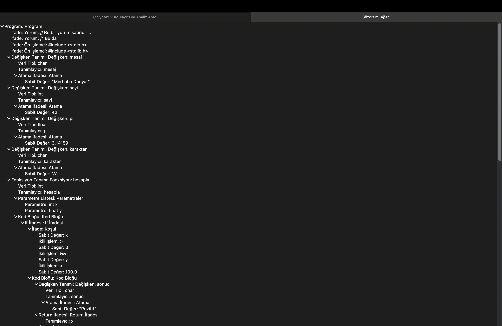

# C Syntax Highlighter with Python 

Bu proje, C programlama diline özel olarak geliştirilmiş, gerçek zamanlı çalışan bir **sözdizimi vurgulayıcı ve analiz aracı**dır. Python ve `tkinter` kullanılarak geliştirilmiş arayüz; hem kullanıcı dostudur hem de token bazlı analiz ve sözdizimi ağacı üretme işlevleri sunar.

---

## Özellikler

### Gerçek Zamanlı Syntax Vurgulama
- C anahtar kelimeleri (`int`, `return`, `while`, `for` vb.)
- Tanımlayıcılar (değişken/fonksiyon isimleri)
- Sayılar (tamsayı ve ondalıklı)
- Operatörler (`+`, `-`, `==`, `!=`, vb.)
- String ve karakter literal'leri
- Tek ve çok satırlı yorum satırları
- Ön işlemci komutları (`#include`, `#define`)
- Ayırıcı semboller (`()`, `{}`, `;`, vb.)
- Gerçek zamanlı vurgulama (her yazımda anında güncelleme)

### Lexical Analiz (Token Listesi)
- Kod token'lara ayrılır ve ayrı bir pencerede ağaç yapısında görüntülenir.
- Her token türü: `Anahtar Kelime`, `Tanımlayıcı`, `Sayı`, `Yorum`, `Operatör`, `Metin`, vb.

### Sözdizimi Analizi (Parse Tree)
- Token listesi `Top-Down` mantıkla parse edilir.
- Kod yapısı hiyerarşik bir sözdizimi ağacı olarak temsil edilir.
- Parse tree ayrı bir pencere üzerinden gezilebilir.

---

## Ekran Görüntüleri

| Ana Arayüz | Lexical Analiz | Parse Tree |
|------------|----------------|-------------|
|  |  |  |
---

## Kullanım

### Gereksinimler
- Python 3.8+
- `tkinter` (Python içinde hazır gelir)

## Demo Videosu
- https://www.youtube.com/watch?v=BTF3QeLcvoc

## Makale
- https://medium.com/@ali.yilmazbgs/gerçek-zamanlı-c-sözdizimi-vurgulama-ve-yapısal-analiz-sistemi-b39999389665

